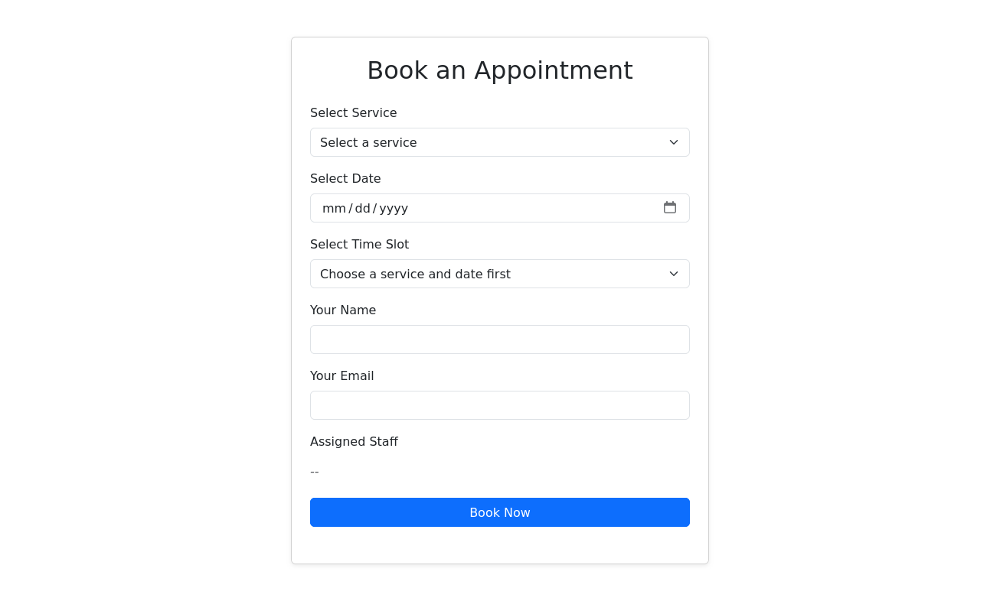
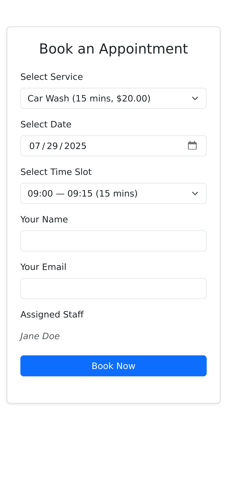
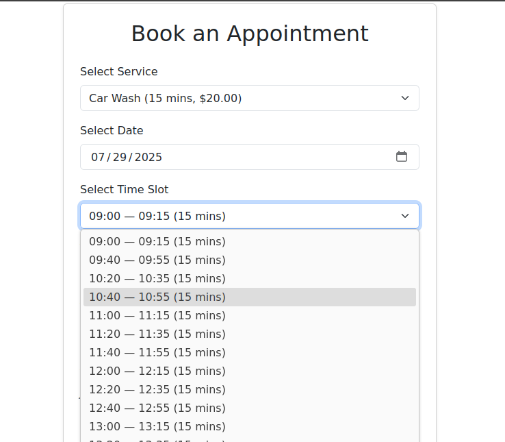
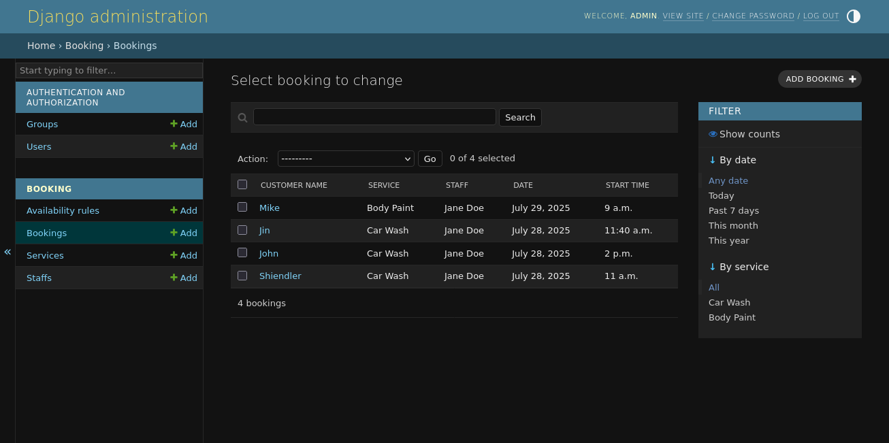

# 🕒 Appointment Booking & Scheduling System

This is a lightweight, single-page appointment booking system designed for small businesses such as salons, spas, clinics, and who ever needs a booking system. Built with **Django (Backend)** and **Vanilla JavaScript (Frontend)**, it provides real-time service availability, staff scheduling, and customer booking—all in one responsive interface.


## Features

- Real-time availability for services and staff
- Dynamic time slot generation with buffer handling
- Custom admin panel for managing services, staff, and schedules
- Fully responsive on mobile and desktop
- No authentication required for clients to book
- Minimalist design with clean UX
- Ready for future extensions like email notifications or dashboards


## Screenshots

### Full Booking Form (Desktop)


### Mobile View


### Dynamic Time Slot Loading


### Django Admin – Services


### Django Admin – Bookings



## Tech Stack

- **Backend:** Django 5.2.3 LTS
- **Frontend:** HTML5, Bootstrap, JavaScript (AJAX implement mostly)
- **Database:** SQLite (Easy to switch to PostgreSQL)


## Project Structure
```bash
├── admin.py
├── models.py
├── static
│   └── booking
│       └── js
│           ├── api.js
│           ├── booking.js
│           └── utils.js
├── templates
│   └── booking
│       └── booking_form.html
├── tests.py
├── urls.py
├── utils.py
└── views.py
```

## How to Run Locally

```bash
git clone https://github.com/MSRhmn/appointment-system.git
cd booking-system
python/python3 -m venv venv
source venv/bin/activate
pip install -r requirements.txt
python/python3 manage.py migrate
python/python3 manage.py runserver
```

## License

© 2025 Md. Shamim Rahman<br>
This project is licensed under the [MIT License](LICENSE).
