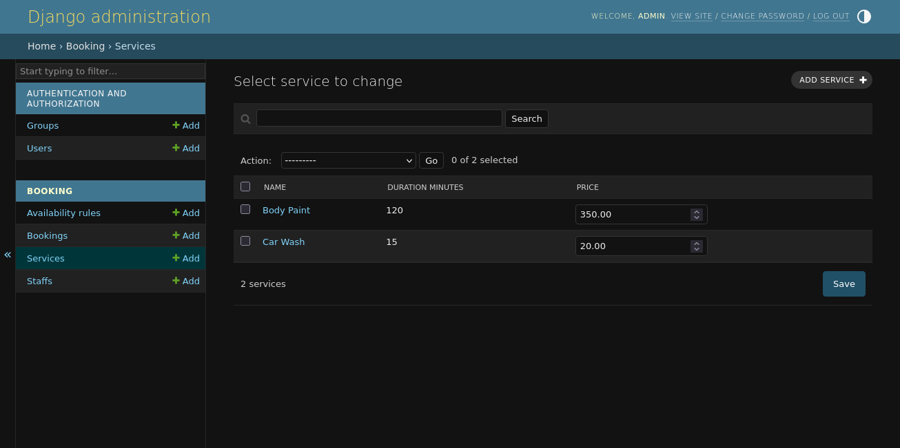

# 🕒 Appointment Booking & Scheduling System

This is a lightweight, single-page appointment booking system designed for small businesses such as salons, spas, clinics, and who ever needs a booking system. Built with **Django (Backend)** and **Vanilla JavaScript (Frontend)**, it provides real-time service availability, staff scheduling, and customer booking—all in one responsive interface.

---

## 🚀 Features

- 📅 Real-time availability for services and staff
- 🕒 Dynamic time slot generation with buffer handling
- 👨‍💼 Custom admin panel for managing services, staff, and schedules
- 📱 Fully responsive on mobile and desktop
- 🔒 No authentication required for clients to book
- 🔧 Minimalist design with clean UX
- 📤 Ready for future extensions like email notifications or dashboards

---

## 🖼️ Screenshots

### ✅ Full Booking Form (Desktop)


### 📱 Mobile View


### 🕓 Dynamic Time Slot Loading


### 🧑‍💼 Django Admin – Services


### 📋 Django Admin – Bookings


---

## ⚙️ Tech Stack

- **Backend:** Django 5.2.3 LTS
- **Frontend:** HTML5, Bootstrap, JavaScript (AJAX implement mostly)
- **Database:** SQLite (easy to switch to PostgreSQL)

---

## Project Structure
```bash
├── admin.py
├── models.py
├── static
│   └── booking
│       └── js
│           ├── booking.js
│           └── utils.js
├── templates
│   └── booking
│       └── booking_form.html
├── tests.py
├── urls.py
├── utils.py
└── views.py
```
---

## How to Run Locally

```bash
git clone https://github.com/MSRhmn/appointment-system.git
cd booking-system
python/python3 -m venv venv
source venv/bin/activate
pip install -r requirements.txt
python/python3 manage.py migrate
python/python3 manage.py runserver
```

## License

© 2025 Md. Shamim Rahman<br>
This project is licensed under the [MIT License](LICENSE).
